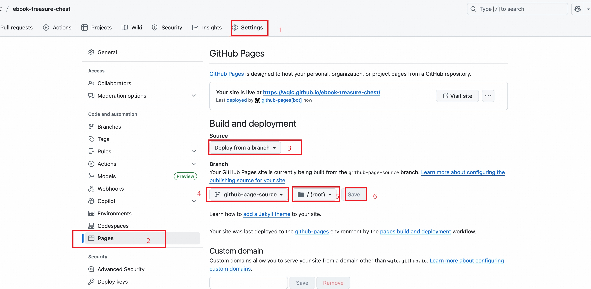

# 电子书宝藏库 - 高性能搜索系统设计文档

本文档旨在阐述“电子书宝藏库”项目前端搜索功能的设计与实现，该方案旨在解决因数据量过大（原索引文件超过16MB）导致的前端加载失败和性能瓶颈问题。




## 1. 核心思想

本方案的核心思想是 **“化整为零，按需加载”**。

- **化整为零**：在构建阶段，将全量书籍数据按“分类”维度拆分成上千个独立的小型 JSON 文件。
- **按需加载**：前端页面在初始化时只加载一个极小的元数据文件，实现页面的瞬时加载。只有在用户执行搜索或浏览特定分类时，才去请求对应的数据文件。

## 2. 系统架构

本系统完全基于纯静态文件，无需后端服务器，可完美托管于 GitHub Pages 等静态托管服务。其主要由两部分构成：

### 2.1 后端构建流程 (Backend Build Process)

由 GitHub Action 自动执行的构建脚本 (`scripts/build-index.js`) 负责数据处理。

- **输入**: `md/` 目录下的大量 Markdown 文件，每个文件代表一个书籍分类。
- **处理**:
    1.  脚本遍历所有 `.md` 文件，解析其中的表格，提取书籍信息（书名、作者、下载链接）。
    2.  将书籍数据按其所属的 Markdown 文件名（即分类）进行分组。
    3.  移除旧的 `lunr.js` 全文索引构建过程。
- **输出**: 在 `docs/data/` 目录下生成以下优化后的数据结构：
    - `docs/data/meta.json`: 一个极小的元数据文件，包含统计信息和所有分类的列表。
      ```json
      {
        "categories": ["AI", "历史", "哲学", ...],
        "stats": {
          "totalBooks": 24068,
          "totalCategories": 1000,
          "lastUpdated": "2025-06-24T..."
        }
      }
      ```
    - `docs/data/books/`: 一个存放所有拆分后数据的目录。
        - `AI.json`
        - `历史.json`
        - `哲学.json`
        - `... (上千个文件)`

### 2.2 前端交互逻辑 (Frontend Interaction Logic)

由 `docs/search.js` 脚本负责驱动前端页面的数据加载与交互。

1.  **页面初始化**:
    -   浏览器打开 `index.html`。
    -   脚本仅 `fetch` 请求轻量的 `meta.json` 文件。
    -   页面根据 `meta.json` 的数据，快速渲染出统计信息和分类列表，实现**秒开**。

2.  **分类浏览**:
    -   用户点击任一分类（如“历史”）。
    -   脚本发起 `fetch` 请求，**只加载**对应的 `data/books/历史.json` 文件。
    -   将该分类下的书籍列表渲染到页面上。

3.  **关键词搜索**:
    -   用户输入关键词（如“明朝”）并点击搜索或按回车。
    -   前端显示“正在搜索中...”的加载状态。
    -   脚本使用 `Promise.allSettled` **并发地请求所有**分类的小型JSON文件（这些请求会被浏览器高度缓存）。
    -   所有数据返回后，在前端内存中进行简单的字符串匹配（检查书名或作者名是否包含关键词）。
    -   将所有匹配到的结果汇总，进行分页并展示给用户。

## 3. 优缺点分析

### 优点

- **极高的初始加载性能**: 彻底解决了因文件过大导致的页面加载失败问题。
- **良好的可扩展性**: 即使未来书籍数量翻倍，初始加载性能几乎不受影响。
- **低成本维护**: 保持了纯静态部署的优势，无需服务器成本和复杂的后端维护。

### 缺点

- **搜索功能降级**: 从全文索引降级为简单的字符串包含匹配，搜索精准度（如相关性排序）有所下降。
- **首次全量搜索延迟**: 用户第一次执行关键词搜索时，需要等待所有分类文件加载完毕，可能会有数秒延迟。但后续搜索会因浏览器缓存而变得非常快。

综上所述，本方案是在保证项目核心功能可用性和高性能的前提下，针对当前纯静态部署模式的最佳实践。
